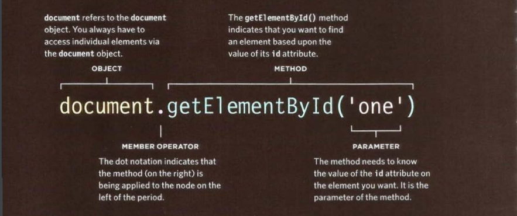

### The most hardest thing about writing code(learning the problem domain.) and other problem like :###
- Learning a new technology
-	Naming things
-	Testing your code
-	Debugging
-	Fixing bugs
-	Making software maintainable

*simple application served as a reference problem domain that didn’t have to be re-learned*
*and provided a way to compare and contrast different technologies*
*simply that by taking away the problem domain, or making it so trivial that it is easily*
*understood, I am able to make both teaching and learning easier.*

**If understanding the problem domain is the hardest part of programming and you want to make programming easier, you can do one of two things:**
1.	Make the problem domain easier
2.	Get better at understanding the problem domain

## Object 
Objects group together a set of variables and functions to create a model,in an object,
variables and functions take on new names.
**IN AN OBJECT: VARIABLES BECOME KNOWN AS PROPERTIES**
**IN AN OBJECT: FUNCTIONS BECOME KNOWN AS METHODS**
properties and methods have a name and a value. In an object, that name is called a key
object cannot have two keys with the same name.
to access the object we use **dot product** ,and To access the properties we use **square brackets**

## The Document Object Model (DOM)
The Document Object Model **(DOM)** specifies how browsers should create a model of an HTML 
page and how JavaScript can access and update the contents of a web page while it is in the browser window.
The DOM is neither part of HTML, nor part of JavaScript; it is a **separate set of rules.**

#### Dom covers two primary areas:
-	Making a model of the HTml pages
-	Accessing and changing the Html pages .
***the DOM an Application Programming Interface (API). User interfaces let humans interact with programs; APls let programs (and scripts) talk to each other***
#### THE DOM TREE IS A MODEL OF A WEB PAGE
As a browser loads a web page, it creates a model of that page. The model is called a DOM tree, and it is stored in the browsers' memory. It consists of four main types of nodes.
-	Document node(When you access any element, attribute, or text node, you navigate to it via the document node. It is the starting point for all visits to the DOM tree.)
-	Text node 
-	Attribute node(Attribute nodes are not children of the element thar carries them)
-	Element node

#### Accessing and updating the DOM tree involves two steps: 
-  Locate the node that represents the element you want to work with.
-  Use its text content, child elements, and attributes.

#### STEP 1: ACCESS THE ELEMENTS
The first two point are known as DOM queries and the third point known as traversing the Dom
- SELECT AN INDIVIDUAL ELEMENT NODE ..Here are common ways to select an individual element:
1-getElementBYId() 
2-querySelector()

- select multiple element (nodelist): There are three common ways to select multiple elements.
1- getElementByClassName(),getElementByTagName(),querySelectorAll() 
- TRAVERSING BETWEEN ELEMENT NODES: parentNode Selects the parent of the current element node (which will return just one element).
- previousSibl ing / nextSibl ing Selects the previous or next sibling from the DOM tree.
  firstChild / lastChild Select the first or last child of the current element.

________________________________________________________

#### STEP 2: WORK W ITH THOSE ELEMENTS
-	ACCESS/ UPDATE TEXT NODES
-	WORK W ITH HTML CONTENT
-	ACCESS OR UPDATE ATTRIBUTE VALUES

***TRAVERSING THE DOM When you have an element node, you can select another element in relation to it using these five properties. This is known as traversing the DOM.***

textContent To collect the text from the elements in our example (and ignore any markup inside the element) you can use the textContent property on the containing element. In this case it would return the value:

DOM manipulation offers another technique to add new content to a page (rather than i nnerHTML). It involves three steps:
-	CREATE THE ELEMENT :createEl ement ()
-	GIVE IT CONTENT : createTextNode()
-	ADD IT TO THE DOM : appendChild()

