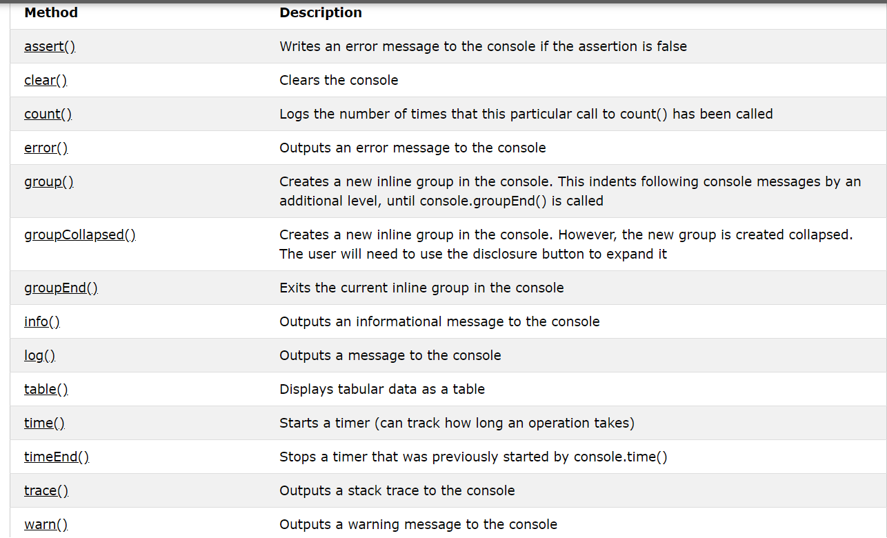

## ERROR HANDLING & DEBUGGING:
Debugging is the process of finding errors. It involves aprocess of deduction.
1-**THE CONSOLE & DEV TOOLS** 
The console helps narrow down the area in which theerror is located, so you can try to find the exact error.

**ORDER OF EXECUTION**
 is very important: Because 
some tasks cannot complete until another statement or function has been run

**EXECUTION CONTEXTE**
every statement in a script lives in one of threeexecution contexts:
- **GLOBAL CONTEXT** :
*Code that is in the script, but not in a function.*
*There is only one global context in any page.* 
- **FUNCTION CONTEXT** :
Code that is being run within a function.
Each function has its own function context. 
- **EVAL CONTEXT** (NOT SHOWN) VARIABLE SCOPE:
Text is executed like code in an internal function
called eva l  (which is not covered in this book). 

 **GLOBAL SCOPE** If a variable is declared outside a function, it canbe used anywhere

**FUNCTION-LEVEL SCOPE**
When a variable is declared within a function,
it can only be used within that function. This is
because it has function-level scope. 

the ***java script*** interpreter processes one line code at a time ..whan a statement needs data from another function it stacks
the new function on a top of the cureent task

## Console Object Methods:
